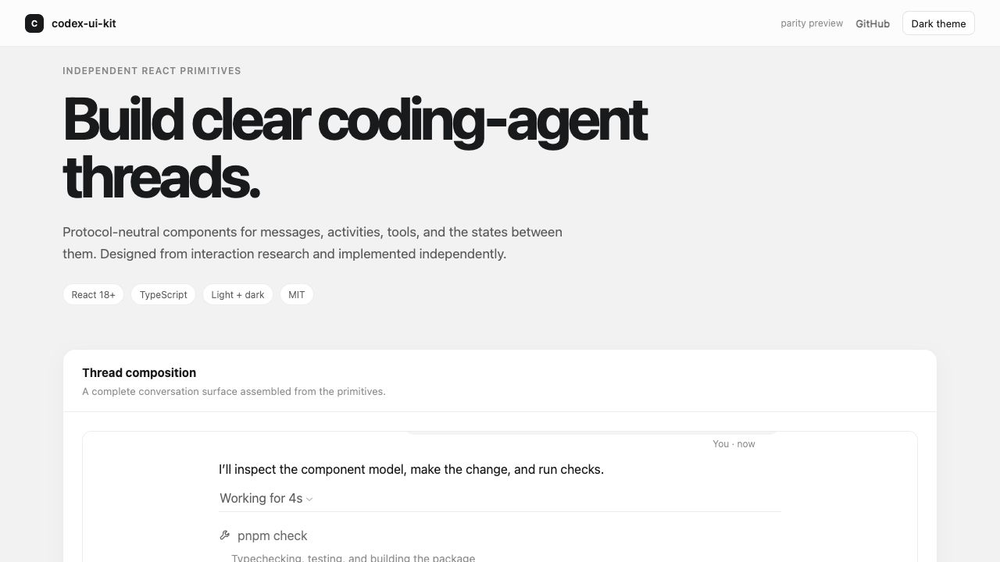

# Codex UI Kit

Independently implemented React components for building high-fidelity coding-agent interfaces.

[](https://github.com/JaminZhou/codex-ui-kit/actions/workflows/ci.yml)
[](https://jaminzhou.com/codex-ui-kit/)
[](LICENSE)

> This is an unofficial, independently developed open-source project for the public Codex ecosystem. It is not affiliated with, sponsored by, or endorsed by OpenAI. Codex and OpenAI are trademarks of OpenAI.



## Why this exists

Coding-agent interfaces need more than a chat bubble. They must present streaming work, reasoning, plans, commands, file changes, approvals, delegated agents, resources, and recovery states without overwhelming the user.

Codex UI Kit turns those interaction patterns into protocol-neutral React primitives. Its public API, markup, styles, icons, and assets are independently written; Codex-specific transport mapping stays outside the component package.

## Status

- Visual and behavioral parity is complete for the current Codex Desktop sample documented in [`research/26.715.21425.md`](research/26.715.21425.md), with the original measured geometry retained in [`research/26.707.72221.md`](research/26.707.72221.md).
- The repository is public and the package baseline is `0.1.0`, but the npm package has **not** been published.
- The API remains pre-1.0 and may change while public documentation and consumer feedback mature.
- Extracted application files, private IPC, bundled fonts, and OpenAI brand assets are not included.

Explore the [interactive component showcase](https://jaminzhou.com/codex-ui-kit/) or review the [parity matrix](research/PARITY.md).

## Highlights

- Complete thread, message, activity, reasoning, plan, and streaming surfaces.
- Command execution, structured file diffs, tool calls, approvals, and notices.
- Composer attachments, mentions, modes, queued prompts, and running states.
- Accessible menus, tooltips, popovers, selects, dialogs, and keyboard flows.
- Resource cards, citations, generated-image galleries, and preview surfaces.
- Light, dark, system, compact-window, reduced-motion, and focus states.
- Browser and Electron acceptance harnesses backed by 261 package tests.
- Protocol-neutral APIs with standalone public CSS tokens.

## Quick start

The package is not yet available from npm. To explore the current public source:

```bash
git clone https://github.com/JaminZhou/codex-ui-kit.git
cd codex-ui-kit
corepack enable
pnpm install --frozen-lockfile
pnpm dev
```

After the first registry release, installation will be:

```bash
pnpm add codex-ui-kit
```

```tsx
import {
  ActivityTimeline,
  AgentMarkdown,
  AgentMessage,
  AgentReasoning,
  AgentThread,
  AgentThreadViewport,
  TurnDuration,
} from "codex-ui-kit";
import "codex-ui-kit/styles.css";

export function Example() {
  return (
    <AgentThreadViewport>
      <AgentThread aria-label="Coding agent thread">
        <AgentMessage role="user">Run the checks.</AgentMessage>
        <AgentMessage role="assistant">
          <AgentMarkdown>{"**Running** `pnpm check`."}</AgentMarkdown>
        </AgentMessage>
        <ActivityTimeline
          defaultOpen
          persistentContent={
            <AgentReasoning status="running">
              Inspecting the test configuration.
            </AgentReasoning>
          }
          summary={<TurnDuration durationMs={4_200} status="working" />}
        />
      </AgentThread>
    </AgentThreadViewport>
  );
}
```

## Component areas

| Area | Main exports |
| --- | --- |
| [Thread and messages](docs/COMPONENTS.md#thread-and-message-surfaces) | `AgentThread`, `AgentTurn`, `AgentMessage`, loading and error states |
| [Rich content](docs/COMPONENTS.md#rich-content) | `AgentMarkdown`, `InlineCode`, `CodeBlock`, `FileDiff` |
| [Agent activity](docs/COMPONENTS.md#agent-activity) | `ActivityTimeline`, `AgentReasoning`, `AgentPlan`, subagent surfaces |
| [Tools and approvals](docs/COMPONENTS.md#tools-approvals-and-status) | `ToolCallCard`, `CommandExecution`, `FileChange`, `ApprovalRequest` |
| [Composer](docs/COMPONENTS.md#composer) | `AgentComposer`, attachments, mentions, modes, queued prompts |
| [Interactive primitives](docs/COMPONENTS.md#interactive-primitives) | Buttons, menus, selects, popovers, tooltips |
| [Resources and media](docs/COMPONENTS.md#resources-and-media) | Resource cards, sources, artifacts, generated images |
| [Navigation and shell](docs/COMPONENTS.md#navigation-and-shell) | Thread header, navigation rail, floating panels and controls |

See the [complete component reference](docs/COMPONENTS.md) for behavior, state, and composition details.

## Themes and tokens

Import the complete component styles:

```tsx
import "codex-ui-kit/styles.css";
```

Or import only the standalone token contract:

```tsx
import "codex-ui-kit/tokens.css";
```

All public variables use the `--codex-ui-` prefix. Set `data-theme="light"` or `data-theme="dark"` on an ancestor to force a theme; otherwise the stylesheet follows the system color scheme.

The font stack names OpenAI Sans only when a host has independently licensed and provided it, then falls back to the native system stack. This package does not redistribute the font.

## Compatibility

The package is ESM-only and supports React 18 and React 19. The browser showcase and Electron playground exercise the same package output. See [`COMPATIBILITY.md`](COMPATIBILITY.md) for browser, Electron, SSR, styling, and support boundaries.

## Research and provenance

The component model is informed by read-only study of publicly observable Codex interactions and locally installed packaged Renderer assets. Research observations are separated from independently written implementation code.

See [`SOURCES.md`](SOURCES.md) and [`research/README.md`](research/README.md). No extracted Renderer files, private service behavior, or OpenAI brand assets are tracked or redistributed.

## Development

```bash
pnpm install --frozen-lockfile
pnpm check
```

`pnpm check` runs type checking, 264 package tests, the library build, the package contract, the browser showcase build, and the Electron main/preload/Renderer checks.

- [`CONTRIBUTING.md`](CONTRIBUTING.md) covers development and visual-acceptance expectations.
- [`CODE_OF_CONDUCT.md`](CODE_OF_CONDUCT.md) defines community expectations.
- [`SECURITY.md`](SECURITY.md) explains private vulnerability reporting.
- [`playgrounds/electron`](playgrounds/electron) validates the package in a real Electron Renderer.

## License

MIT
