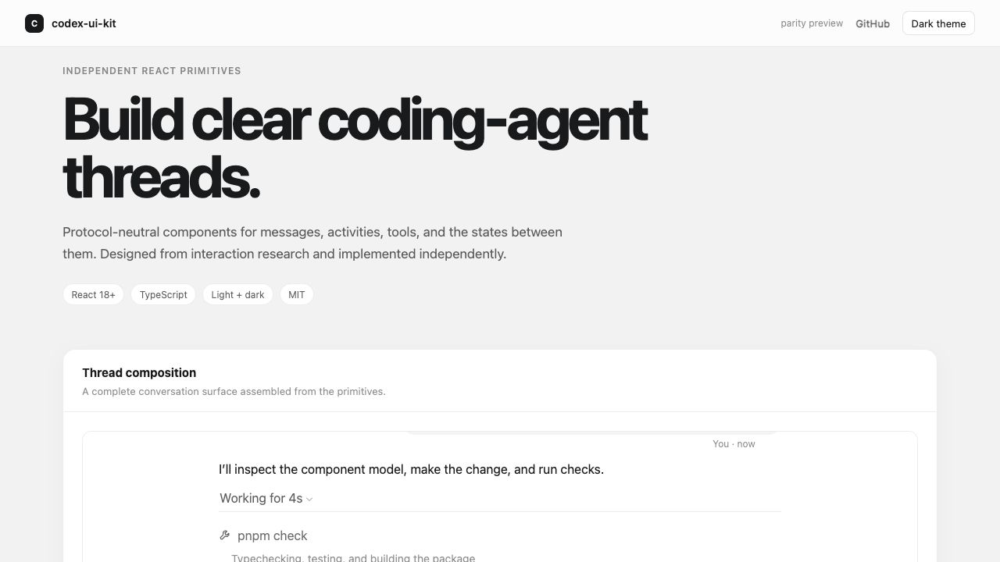

# Codex UI Kit

Independently implemented React components for building high-fidelity coding-agent interfaces.

[](https://github.com/JaminZhou/codex-ui-kit/actions/workflows/ci.yml)
[](https://github.com/JaminZhou/codex-ui-kit/actions/workflows/codeql.yml)
[](https://jaminzhou.com/codex-ui-kit/)
[](LICENSE)

> This is an unofficial, independently developed open-source project for the public Codex ecosystem. It is not affiliated with, sponsored by, or endorsed by OpenAI. Codex and OpenAI are trademarks of OpenAI.



## Why this exists

Coding-agent interfaces need more than a chat bubble. They must present streaming work, reasoning, plans, commands, file changes, approvals, delegated agents, resources, and recovery states without overwhelming the user.

Codex UI Kit turns those interaction patterns into protocol-neutral React primitives. Its public API, markup, styles, icons, and assets are independently written; Codex-specific transport mapping stays outside the component package.

## Status

- The current components are a partial coding-agent UI foundation, not a
  complete Codex Desktop reconstruction.
- The authoritative full-surface inventory baseline remains `26.730.61639`
  (`6234`). Its seed candidate surface and evidence status are tracked in
  [`research/UI_INVENTORY.md`](research/UI_INVENTORY.md); current-build
  runtime observation currently covers the Terminal session shell, direct
  running/completed panel persistence, cross-worktree mismatch recovery, and
  one real delegated-subagent success path from active work through summary,
  side panel, and transcript.
  The broader `26.730.61309` shell/sidebar, route, command, approval,
  compaction, summary, attachment, workspace-entry, and Review evidence is
  retained as previous-build coverage rather than promoted implicitly.
  A narrower visual-provenance probe against the newer installed
  `26.803.41515` (`6321`) build revalidates five existing sidebar icons and
  promotes five more exact sidebar icons without claiming that the broader UI
  inventory has been refreshed.
- The repository is public and the package baseline is `0.1.0`, but the npm package has **not** been published.
- The API remains pre-1.0 and may change while public documentation and consumer feedback mature.
- Extracted application files, private IPC, bundled fonts, and OpenAI brand assets are not included.

Explore the [interactive component showcase](https://jaminzhou.com/codex-ui-kit/),
review the [coverage policy](research/PARITY.md), or follow the
[delivery plan](research/DELIVERY_PLAN.md).

## Highlights

- A conversation shell with build-scoped `26.730.61309` evidence for
  successful long command output and `26.727.40816` historical evidence for
  Composer lifecycle, successful/recovered MCP calls, long-thread navigation,
  and command-approval denial, plus partial message, activity, reasoning,
  plan, streaming, and mixed event primitives.
- Application/sidebar and side/bottom workspace-panel composition with
  current-build window navigation, route lifecycle feedback, portalled global
  notifications, responsive restoration rules, and pointer- and
  keyboard-resizable navigation and bottom-panel tracks.
- Current `26.730.61639` Terminal evidence for project-labelled multi-session
  tabs, real running/completed close/reopen persistence, close-last/fresh
  creation, compact fit, and cross-worktree mismatch recovery.
- Current `26.730.61639` subagent evidence for active/completed timeline,
  populated summary, wide list, nested transcript, and explicit 820px/720px
  responsive reopen, backed by CDP styles, Electron interaction, and regional
  pixels.
- Project index, current-build new-chat destination/context setup and
  New worktree environment-empty flow, grouped host-defined local environment
  dialog, protocol-neutral route/worktree selectors, PR list/detail, checks,
  reviewers, and inline review-thread compositions.
- Command execution with current-build long-output/tail-following evidence,
  structured file diffs, tool calls, approvals, and notices.
- Composer attachments, mentions, modes, queued prompts, and running states.
- A reusable thread-summary popover with collapsible sections, compact action
  rows, change deltas, disabled states, and controlled/uncontrolled behavior.
- Accessible menus, tooltips, popovers, selects, dialogs, and keyboard flows.
- Resource cards, citations, generated-image galleries, and preview surfaces.
- Light, dark, system, compact-window, reduced-motion, and focus states.
- Package tests, full-export React 18/19 consumer checks, headless-Chrome accessibility checks, CodeQL scanning, a browser showcase build, and an executable Electron acceptance harness.
- Protocol-neutral APIs with standalone public CSS tokens.
- A private protocol-backed Codex app playground that validates the UI Kit
  together with the public App Server client.

## Quick start

The package is not yet available from npm. To explore the current public source:

```bash
git clone https://github.com/JaminZhou/codex-ui-kit.git
cd codex-ui-kit
corepack enable
pnpm install --frozen-lockfile
pnpm dev
```

After the first registry release, installation will be:

```bash
pnpm add codex-ui-kit
```

```tsx
import {
  ActivityTimeline,
  AgentMarkdown,
  AgentMessage,
  AgentReasoning,
  AgentThread,
  AgentThreadViewport,
  TurnDuration,
} from "codex-ui-kit";
import "codex-ui-kit/styles.css";

export function Example() {
  return (
    <AgentThreadViewport>
      <AgentThread aria-label="Coding agent thread">
        <AgentMessage role="user">Run the checks.</AgentMessage>
        <AgentMessage role="assistant">
          <AgentMarkdown>{"**Running** `pnpm check`."}</AgentMarkdown>
        </AgentMessage>
        <ActivityTimeline
          defaultOpen
          persistentContent={
            <AgentReasoning status="running">
              Inspecting the test configuration.
            </AgentReasoning>
          }
          summary={<TurnDuration durationMs={4_200} status="working" />}
        />
      </AgentThread>
    </AgentThreadViewport>
  );
}
```

## Component areas

| Area | Main exports |
| --- | --- |
| [Thread and messages](docs/COMPONENTS.md#thread-and-message-surfaces) | `ConversationThreadShell`, `AgentThread`, `AgentTurn`, `AgentMessage`, loading and error states |
| [Rich content](docs/COMPONENTS.md#rich-content) | `AgentMarkdown`, `InlineCode`, `CodeBlock`, `FileDiff`, `FileReview` |
| [Agent activity](docs/COMPONENTS.md#agent-activity) | `ActivityTimeline`, `AgentReasoning`, `AgentPlan`, subagent surfaces |
| [Tools and approvals](docs/COMPONENTS.md#tools-approvals-and-status) | `BrowserActivity`, `McpToolCallGroup`, `ToolCallCard`, `CommandExecution`, `FileChange`, `FileChangeGroup`, `ApprovalRequest` |
| [Composer](docs/COMPONENTS.md#composer) | `AgentComposer`, `ComposerDock`, context controls, attachments, mentions, modes, queued prompts |
| [Interactive primitives](docs/COMPONENTS.md#interactive-primitives) | Buttons, dialogs, menus, selects, popovers, tooltips |
| [Resources and media](docs/COMPONENTS.md#resources-and-media) | Resource cards, sources, artifacts, generated images |
| [Navigation and shell](docs/COMPONENTS.md#navigation-and-shell) | Application/sidebar shell, workspace tabs, thread header, thread-summary panel, navigation rail, floating controls |
| [Workspace and PR workflow](docs/COMPONENTS.md#workspace-and-pull-request-workflow) | Terminal session primitives, project index, new-chat destination/context, local environments, protocol-neutral routing/worktree selectors, PR lists, details, checks, reviewers, and threads |

See the [complete component reference](docs/COMPONENTS.md) for behavior, state, and composition details.

## Themes and tokens

Import the complete component styles:

```tsx
import "codex-ui-kit/styles.css";
```

Or import only the standalone token contract:

```tsx
import "codex-ui-kit/tokens.css";
```

All public variables use the `--codex-ui-` prefix. Set `data-theme="light"` or `data-theme="dark"` on an ancestor to force a theme; otherwise the stylesheet follows the system color scheme.

The font stack names OpenAI Sans only when a host has independently licensed and provided it, then falls back to the native system stack. This package does not redistribute the font.

## Compatibility

The package is ESM-only and supports React 18 and React 19. The browser showcase and Electron playground exercise the same package output. See [`COMPATIBILITY.md`](COMPATIBILITY.md) for browser, Electron, SSR, styling, and support boundaries.

## Research and provenance

The component model is informed by read-only study of publicly observable Codex interactions and locally installed packaged Renderer assets. Research observations are separated from independently written implementation code.

See [`SOURCES.md`](SOURCES.md) and [`research/README.md`](research/README.md). No extracted Renderer files, private service behavior, or OpenAI brand assets are tracked or redistributed.

## Development

```bash
pnpm install --frozen-lockfile
pnpm check
```

`pnpm check` runs type checking, the package test suite, the library build, the
package contract, the browser showcase build, WCAG A/AA/2.2 browser checks for
the static page and open overlay states, the package Electron checks, and the
deterministic protocol-backed Codex app checks.

The completed dark conversation fixture also supports an explicit
current-build raster gate without committing the proprietary reference:

```bash
CODEX_UI_KIT_THREAD_REFERENCE=/absolute/path/to/main-only-reference.png \
  pnpm check:visual:current-thread
```

The script renders at the PNG dimensions and gates the full screenshot plus
the header, message band, and Composer regions independently. Reference and
diff images remain outside the package by default.

The protocol-backed Codex App playground also accepts independent,
untracked current-build references for multi-file Review, Pull request detail,
and Terminal:

```bash
CODEX_UI_KIT_PULL_REQUEST_REFERENCE=/absolute/path/to/pr-main-reference.png \
  pnpm --filter @codex-ui-kit/codex-app-playground check:visual
```

That PR gate compares the 906×820 main region and its index/detail ownership
regions separately; CDP and Electron still gate geometry and interaction
independently.

The Terminal gate uses its own 906×820 reference and applies hard pixel
thresholds only to the shared 272px bottom-panel and 239px content regions.
Its current-build comparison is scoped to `terminal-current-single`:

```bash
CODEX_UI_KIT_TERMINAL_REFERENCE=/absolute/path/to/terminal-main-reference.png \
  pnpm --filter @codex-ui-kit/codex-app-playground check:visual \
  -- --scenes=terminal-current-single
```

The subagent gate accepts three raw 1180×820 current-build captures and
compares only the owned summary, side-panel list, and transcript regions:

```bash
CODEX_UI_KIT_SUBAGENT_SUMMARY_REFERENCE=/absolute/path/to/subagent-summary.png \
CODEX_UI_KIT_SUBAGENT_PANEL_REFERENCE=/absolute/path/to/subagent-panel.png \
CODEX_UI_KIT_SUBAGENT_TRANSCRIPT_REFERENCE=/absolute/path/to/subagent-transcript.png \
  pnpm --filter @codex-ui-kit/codex-app-playground check:visual \
  -- --scenes=subagent-current-summary-completed,subagent-current-panel-completed,subagent-current-transcript
```

Current command approval accepts separate untracked pending and denied
906×820 main references. CDP and Electron independently gate the request,
options-menu focus, rejection, confirmed non-execution, final response, and
Composer restoration:

```bash
CODEX_UI_KIT_APPROVAL_PENDING_REFERENCE=/absolute/path/to/pending.png \
CODEX_UI_KIT_APPROVAL_DENIED_REFERENCE=/absolute/path/to/denied.png \
  pnpm --filter @codex-ui-kit/codex-app-playground check:visual \
  -- --scenes=approval-current-pending,approval-current-denied
```

`npm pack` and a future `npm publish` run the library build first so the ignored
`dist/` directory is always generated from the checked-out source. The package
remains marked private until the first registry release is approved explicitly.

- [`CONTRIBUTING.md`](CONTRIBUTING.md) covers development and visual-acceptance expectations.
- [`CODE_OF_CONDUCT.md`](CODE_OF_CONDUCT.md) defines community expectations.
- [`SECURITY.md`](SECURITY.md) explains private vulnerability reporting.
- [`playgrounds/electron`](playgrounds/electron) validates the package in a real Electron Renderer.
- [`playgrounds/codex-app`](playgrounds/codex-app) validates protocol lifecycle,
  CDP geometry, Electron host behavior, and pixel baselines with the pinned
  public App Server client.

## License

MIT
